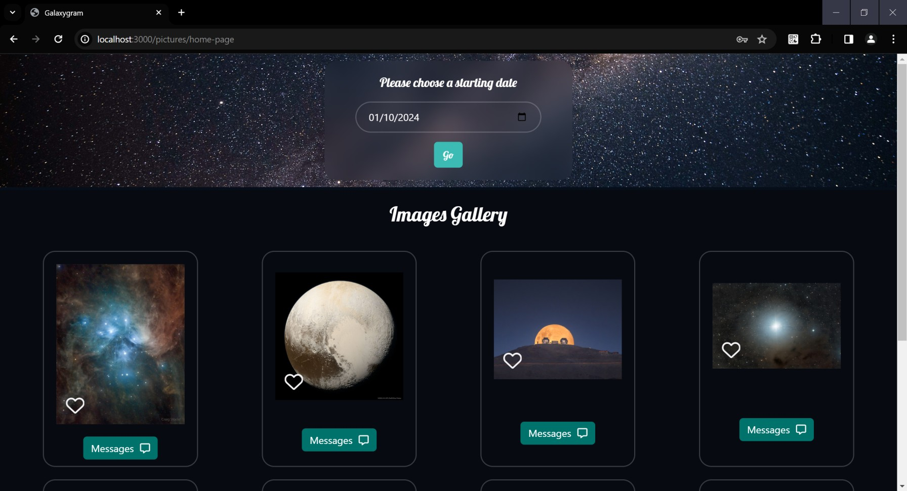
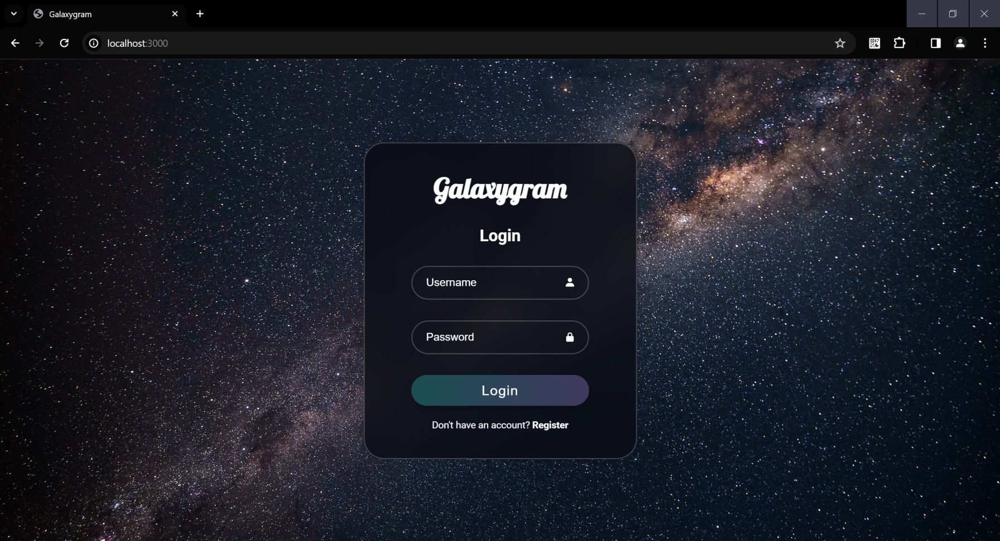
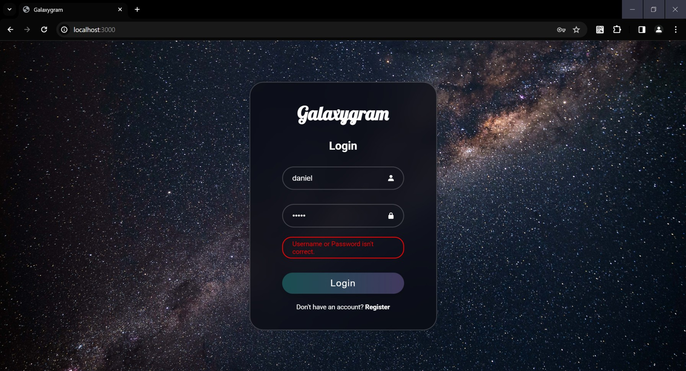
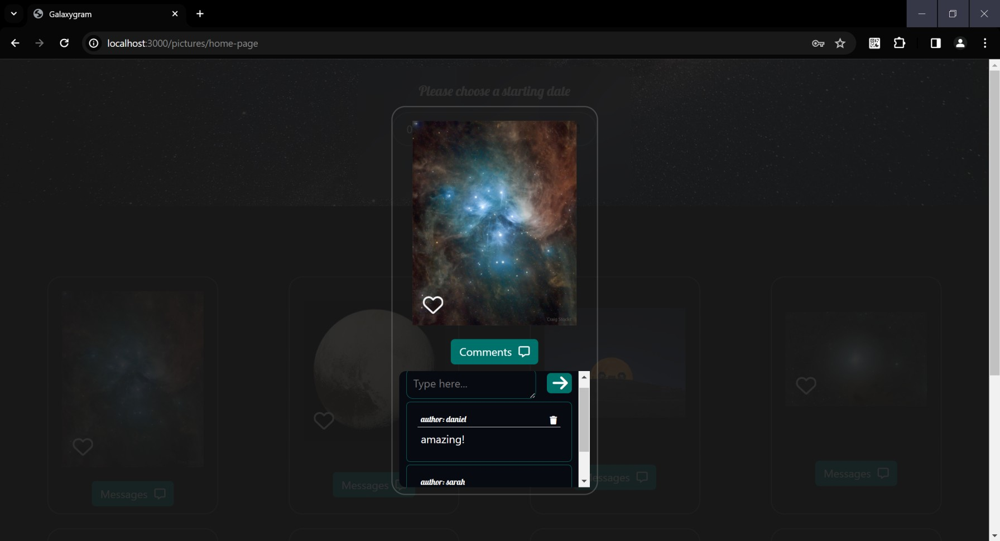

# NASA Image API

## Overview:
This project is a RESTful web API built using Express.js and Node.js. The API allows users to interact with NASA's image collection. Users can register, log in, select a starting date, fetch images for each day from the NASA API, and leave comments on each picture. The client-side code incorporates asynchronous programming for improved responsiveness.



## Technologies Used:
- **Node.js**: JavaScript runtime for server-side development.
- **Express.js**: Web application framework for Node.js.
- **CSS and JavaScript**: Used for styling and interactivity on the client-side, featuring asynchronous programming.
- **NASA API**: Used to fetch a series of pictures based on the selected starting date.
- **Sessions**: Implemented for user authentication and maintaining login state.
- **Infinite scrolling**: To dynamically load more content on a page <a href="https://webdesign.tutsplus.com/tutorials/how-to-implement-infinite-scrolling-with-javascript--cms-37055">see here.</a>

## Project Structure:
- **Controllers**: Responsible for processing HTTP requests and handling business logic.
- **Models**: Define data structures and interact with the database.
- **Routes**: Define RESTful API endpoints and associate them with controllers.
- **Middleware**: Implement authentication and other middleware functions.
- **Public**: Static assets like CSS and client-side JavaScript.

## Getting Started:
1. Clone the repository to your local machine.
   ```bash
   git clone <repository_url>
2. Install project dependencies.
   npm install
3. Obtain a NASA API key and update the configuration to include the key for fetching images.
   see <a href="https://api.nasa.gov/">NASA API</a>
4. Configure session settings and any other environment variables required (optinal).

## Running the Application:
1. Run the application on your local machine.
   ```bash
   npm start
2. The API will be accessible at http://localhost:3000 by default.

## Asynchronous Programming on Client Side:
The client-side JavaScript code utilizes asynchronous programming techniques for improved responsiveness and a seamless user experience.

## API Endpoints:
- **/auth/**: User registration and login.
- **/pictures/**: Fetch images based on the selected starting date..
- **/comments/**: Used for styling and interactivity on the client-side, featuring asynchronous programming.

## Dependencies:
- Express.js
- Express-Session
  Other necessary packages (see package.json)

## Licence:
Free for personal use, see also NASA Api licence <a href="https://api.nasa.gov/">Here.</a> 

## Images:



